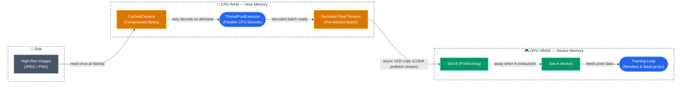

# Stage 1 — Lazy-Decode Camera Pipeline

```mermaid
flowchart LR
    classDef disk      fill:#475569,stroke:#94a3b8,stroke-width:2px,color:#ffffff
    classDef ram       fill:#d97706,stroke:#fcd34d,stroke-width:2px,color:#ffffff
    classDef vram      fill:#059669,stroke:#6ee7b7,stroke-width:2px,color:#ffffff
    classDef compute   fill:#2563eb,stroke:#93c5fd,stroke-width:2px,color:#ffffff
    classDef container fill:none,stroke:#64748b,stroke-width:2px,stroke-dasharray:5 5
    classDef invisible fill:none,stroke:none

    subgraph LEFT [" "]
        direction TB

        subgraph Disk ["💾 Disk"]
            direction TB
            IMG["High-Res Images\n(JPEG / PNG)"]:::disk
        end

        subgraph GPU ["🎮 GPU VRAM  —  Device Memory"]
            direction TB
            SB["Slot B  (Prefetching)"]:::vram
            SA["Slot A  (Active)"]:::vram
            TL(["Training Loop\n(Renders & Back-props)"]):::compute
            SB -. "swap when A exhausted" .-> SA
            SA -- "feeds pixel data" --> TL
        end
    end

    subgraph CPU ["🧠 CPU RAM  —  Host Memory"]
        direction TB
        CB["CachedCamera\n(Compressed Bytes)"]:::ram
        TP(["ThreadPoolExecutor\n(Parallel CPU Decode)"]):::compute
        FT["Decoded Float Tensors\n(Pre-fetched Batch)"]:::ram
        CB -- "lazy decode on demand" --> TP
        TP -- "decoded batch ready"   --> FT
    end

    IMG -- "read once at startup"               --> CB
    FT  -- "async H2D copy (CUDA prefetch stream)" --> SB

    class LEFT invisible
    class Disk,CPU,GPU container
```
